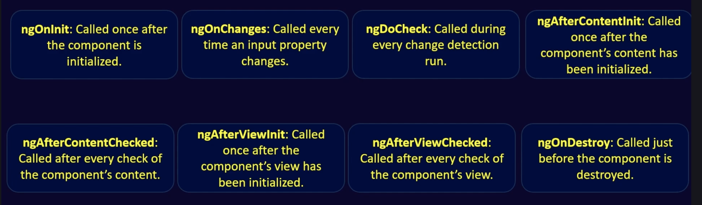

# Angular-Notes

## What is Angular?
- Angular is a TypeScript-based component based front-end framework developed by Google for building single-page web applications (SPAs). It uses components, dependency injection, and two-way data binding to create dynamic and scalable web apps.
- A framework building client application in HTML, CSS Javascript/Typescript.

**SPA(Single Page Application):** An app that doesn't need to reload the page during it's use and work with the browswer. 

## Why use
- Give our application a clean structure
- Re-usable lots of Code
- Single page application
- Easy to maintain and Read
- Make our application more testable
1. Two-Way Data Binding – Keeps UI and data in sync automatically.
2. Component-Based Architecture – Reusable and maintainable code.
3. Dependency Injection – Easy to manage services and dependencies.
4. Built-in Routing – Helps build single-page apps with multiple views.
5. TypeScript Support – Better tooling, type checking, and cleaner code.
6. Powerful CLI – Speeds up development with commands for components, services, etc.
7. Cross-Platform – Can build web, mobile, and desktop apps.

# Architecture


## Modules
- A Module is a unit that consists of a separate block to perform specific functionality and enables us to break down the application into smaller chunks.
- In a module, we can export & import the components and services from other modules.
- Modules are created using the @NgModule decorator.
### Types of Modules:
1. Core Module/Root Module:
- Every Angular application must have at least one root module, which is called the AppModule, defined in the app.module.ts file.
- The root module is the top-level module in an Angular application.
- It imports all of the other modules in the application.
2. Feature Module:
- Feature modules are used to group related components, directives, pipes, and services together.
3. Shared Module:
- The most commonly used functionality will be present in the shared module which can be imported by the feature module whenever needed.

```
import { NgModule } from '@angular/core';
import { BrowserModule } 
    from '@angular/platform-browser';
import { AppRoutingModule }
    from './app-routing.module';
import { AppComponent } from './app.component';
@NgModule({
    declarations: [
        AppComponent
    ],
    imports: [
        BrowserModule,
        AppRoutingModule
    ],
    providers: [],
    bootstrap: [AppComponent]
})
export class AppModule { }
```

## Components
- A Component is the building block of the angular application.
- A component consists of a template(HTML view of UI), styles(CSS appearance/design) and a typescript class which contains business logic.
- To indicate a class as component @Component decorator is used.
- The @Component decorator provides metadata to the component.
- The component metadata properties consist of selectors, directives, providers, styleUrls and templateUrls.
```
import { Component } from '@angular/core';
@Component({
    selector: 'app-root',
    templateUrl: './app.component.html',
    styleUrls: ['./app.component.css']
})
export class AppComponent {
    title = 'AngularApp';
}
```
## Templates
- The user interface or the view of the end users is defined using the template.
- Templates are created using HTML and it binds the component properties and methods thus helping us to render data dynamically.
- Template syntax includes directives, interpolation, built-in directives, template expression operators, property binding, and event binding for creating dynamic and interactive views.
```
<h2>Welcome to GeeksForGeeks</h2>
<p>Angular Architecture consists of :</p>
<ul>
    <li>Modules</li>
    <li>Components</li>
    <li>Templates</li>
    <li>Directives</li>
    <li>Services</li>
    <li>Dependency Injection(DI)</li>
    <li>Router</li>
    <li>HTTP Client</li>
    <li>State Management</li>
</ul>
```
## Directives
- Directives are instructions in the DOM (Document Object Model).
- Directives are used in templates to customize the behaviour of the elements.
- Angular provides built-in directives like *ngIf and *ngFor, as well as custom directives created by developers.
### Types of directives:
1. Component Directives
  - These directives are associated with the template(view) of a component.
2. Structural Directives
  - These directives are used to change the structure of the DOM using *ngFor,*ngSwitch and *ngIf.
3. Attribute Directives
  - These directives are used to change the behaviour of the DOM using ngStyle, ngModel and ngClass.
4. Custom Directives
  - We can create custom directives using @Directive decorator and define the desired behaviour in the class.

## Services
- Services are used when specific data or logic needs to be used across different components.
- Services are typically used to centralize data access, HTTP requests, state management, and other common tasks.
- Services are singleton and are registered with Angular's dependency injection system.
- Components can inject services to access their functionality and data.
- command to create:
```ng generate service counter```
```
import { Injectable } from '@angular/core';
@Injectable({
    providedIn: 'root',
})
export class CounterService {
    private count = 0;
    increment(): void {
        this.count++;
    }
    getCount(): number {
        return this.count;
    }
}
```
## Dependency Injection(DI)
- Dependency injection simplifies dependency management, facilitates code reusability and simplifies testing.
- DI is a design pattern which increases the flexibility and modularity of the applications by producing and distributing specific parts of the application to other parts of the application that need them.
- We can inject services, configuration values, and other objects into components and services.
- Components and services can declare their dependencies and have them injected automatically using @Injectable decorator.

## Router
- The Angular Router manages navigation within the application for changing from one view to another view.
- Routes are defined in the app-routing.module.ts file and map to specific components.
- The router also supports route parameters, route guards, and child routes for creating complex navigation structures.
```
import { NgModule } from '@angular/core';
import { Routes, RouterModule } 
    from '@angular/router';
import { EmployeeListComponent } 
    from './employee-list/employee-list.component';
import { CreateEmployeeComponent } 
    from './create-employee/create-employee.component';
import { UpdateEmployeeComponent } 
    from './update-employee/update-employee.component';
import { EmployeeDetailsComponent } 
    from './employee-details/employee-details.component';
const routes: Routes = [
    { path: 'employees', 
      component: EmployeeListComponent },
    { path: 'create-employee', 
      component: CreateEmployeeComponent },
    { path: '', redirectTo: 'employees', 
      pathMatch: 'full' },
    { path: 'update-employee/:id',
      component: UpdateEmployeeComponent },
    { path: 'employee-details/:id', 
      component: EmployeeDetailsComponent }
];
@NgModule({
    imports: [RouterModule.forRoot(routes)],
    exports: [RouterModule]
})
export class AppRoutingModule { }
```
## State Management
- State management in angular is achieved using RxJS (Reactive Extensions for JavaScript).
- RxJS is used for handling asynchronous operations, such as handling HTTP requests, user interactions, and event-driven programming.
- Streams of data and events are managed by Observables which is provided by RxJS.

## HTTP Client
- HTTP client module in angular is used for making HTTP requests to interact with backend services(API calls) to fetch or send data.
```
import { Component, OnInit } 
    from '@angular/core';
import { HttpClient } 
    from '@angular/common/http';
@Component({
    selector: 'app-post-list',
    templateUrl: './post-list.component.html',
    styleUrls: ['./post-list.component.css'],
})
export class PostListComponent implements OnInit {
    posts: any[] = [];
    constructor(private http: HttpClient) { }
    ngOnInit(): void {
        this.http
            .get < any[] > (
            'https://jsonplaceholder.typicode.com/posts')
                .subscribe((data) => {
                    this.posts = data;
                });
    }
}
```
# Start Created Angular App
- install node
- instal angular cli - npm install -g @angular/cli  (So If you not using / here then angular cli will be install only for current folder)

# 1. Start Created Angular App
- install node
- instal angular cli - [npm install -g @angular/cli], [sudo npm install @angular/cli]  (So If you not using / here then angular cli will be install only for current folder)
- ng new project_name
- goto vs code and install code path click - shift+cmd+p then enter code and install shell commond
- goto project path in terminal and code . (Now your vs code will be open)
- ng serve ( terminal to run application)

# 2. Steps to Create the Application

1. Step 1 : Install the Angular CLI using the following command
    - npm install -g @angular/cli
2. Step 2: Create a new Angular Project.
    - ng new new-project
    - cd new-project
3. Step 3: To start the application run the following command.
    - ng serve

## Angular CLI 
- Angular CLI (Command Line Interface) is a powerful tool provided by Angular to automate and streamline your development workflow.
- The Angular CLI is a command-line interface tool that is used to initialize, develop, scaffold, and maintain Angular applications directly from a command shell.

# Project - Structure


# <app.root></app.root>
- <app-root> is a custom HTML tag (element) defined by Angular. It represents the root component of your Angular application — typically AppComponent. It's component selector of the app component.(Check app.ts file)

# standalone
### In Angular, the standalone: true or standalone: false flag is used in a component’s metadata to indicate whether it is a "standalone" component or not.
- ✅ standalone: true
    - This means the component does not belong to any Angular module (NgModule) and can be used independently.
    - You don’t need to declare it in any NgModule.
    - You can bootstrap it directly using bootstrapApplication(LoginComponent) in main.ts.
- standalone: false (or omitted)
    - This is the default behavior in Angular before standalone components existed.
    - ❗ Must be declared in an NgModule, like this:
```
//ts
@NgModule({
  declarations: [LoginComponent],
})
export class AppModule {}
```
| Feature                           | `standalone: true`             | `standalone: false` (default) |
| --------------------------------- | ------------------------------ | ----------------------------- |
| Needs to be declared in NgModule? | ❌ No                           | ✅ Yes                         |
| Bootstrappable directly?          | ✅ Yes (`bootstrapApplication`) | ❌ No (use `NgModule` only)    |
| Import dependencies?              | ✅ Uses `imports` array         | ❌ Uses module’s imports       |

### 🎯 When to use?
- ✅ Use standalone: true when you're building modern, lightweight, modular components.
- ✅ Use standalone for micro frontends, dynamic loading, or component libraries.

# Nesting Component
- Have to add custom component in import in app.component.ts. In the example Login is my component.
```
@Component({
  selector: 'app-root',
  imports: [RouterOutlet, Login],
  templateUrl: './app.html',
  styleUrl: './app.css'
})
```
# Template Property
- In Angular, the template property is used inside the @Component decorator to define the HTML structure of the component inline (within the TypeScript file), instead of using an external file.
 ```
   @Component({
  selector: 'app-welcome',
  template: `<h1>Welcome to My App!</h1>`,  // 👈 inline HTML
})
export class WelcomeComponent {}
```
- If your component is big then use templateUrl instead of template
```
@Component({
  selector: 'app-welcome',
  templateUrl: './welcome.component.html',  // 👈 External HTML file
})
```
# Style Property
- The styles (not style) property in Angular is used in the @Component decorator to define inline CSS styles directly within the TypeScript file.
```
@Component({
  selector: 'app-hello',
  template: `<h1>Hello Angular</h1>`,
  styles: [`
    h1 {
      color: blue;
      font-family: Arial;
    }
  `]
})
export class HelloComponent {}
```

# Data Binding
- Data binding in Angular connects the component's TypeScript code and the HTML template, allowing them to communicate and stay in sync.
- Angular provides 4 main types of data binding:
1. Interpolation ({{ }})
2. Property Binding ([property]="value")
3. Event Binding ((event)="handler()")
4. Two-Way Binding ([(ngModel)])

### 1. Interpolation ({{ }})
- Direction: Component ➡️ Template
- Use: To display data from the component in the HTML.
```
// app.component.ts
export class AppComponent {
  title = 'Angular App';
}
```
```
<!-- app.component.html -->
<h1>{{ title }}</h1>  <!-- Output: Angular App -->
```
### 2. Property Binding ([property]="value")
- Direction: Component ➡️ Template
- Use: To bind component values to HTML element properties.
```
// ts
imgUrl = 'logo.png';
```
```
// html
  <!-- Binds src to the component's imgUrl -->
```
### 3. Event Binding ((event)="handler()")
- Direction: Template ➡️ Component
- Use: To handle events like click, input, etc., from HTML and run functions in the component.
```
count = 0;
increment() {
  this.count++;
}
```
```
<button (click)="increment()">Click Me</button>
<p>{{ count }}</p>
```
### 4. Two-Way Binding ([(ngModel)])
- Direction: Component ⬄ Template (Two-Way)
- Use: To sync data both ways — like form inputs.
Requires FormsModule in app.module.ts
```
username = '';
```
```
<input [(ngModel)]="username" placeholder="Enter name" />
<p>Hello, {{ username }}</p>
```

| Type             | Syntax               | Direction        | Purpose                          |
| ---------------- | -------------------- | ---------------- | -------------------------------- |
| Interpolation    | `{{ value }}`        | Component → View | Show dynamic text                |
| Property Binding | `[property]="value"` | Component → View | Set element properties           |
| Event Binding    | `(event)="handler"`  | View → Component | Handle DOM events                |
| Two-Way Binding  | `[(ngModel)]="prop"` | Both ways        | Sync input fields with component |


### 5. Class Binding
```
//html
  <button [class.btnHeight]= "fruitName == 'Apple' ">{{fruitName}}</button>
//css
.btnHeight {
    height : 30px;
    width : 80px;
    background-color: chocolate;
    border-radius: 10px;
}
//ts
 fruitName : string = 'Apple'
```
# Style Binding
```
  <button [style.background] = " isActive ? 'green' : 'gold' ">Style Binding</button>
```

### Multiple Binding
```
<button
  [style.background]=" isActive ? 'green' : 'gold' "
  [style.border]=" isActive ? '2px solid red' : '5px dotted black' "
>
  Style Binding
</button>
```

# Event Binding

//html
```
<button (click)="eventButtonClick()">Event Binding</button>
<input type="text" placeholder="Enter Name" (keyup)="keyUpFunc($event)"/>
<input type="text" placeholder="Click Enter then Call function" (keyup.enter)="keyUpFilter($event)"/>  <!-- When click enter button then only call function -->
<input type="text" placeholder="Enter a then Call function" (keyup.a)="keyUpAFilter($event)"/>  <!-- When click enter a then only call function -->
```
// ts
```
 // Event Binding
  eventButtonClick(){
    console.log('button clicked')
  }
  keyUpFunc(event: any){
    console.log('hii',event.target.value)
  }
  keyUpFilter(event: any){
      console.log(event.target.value)
  }
   keyUpAFilter(event: any){
      console.log(event.target.value)
  }
```

# Template Variable
- A template variable in Angular is a way to reference a DOM element or Angular component directly from the HTML template — without needing to bind or store it in the component's .ts file.

```
<input #usernameInput type="text" />
<button (click)="logUsername(usernameInput.value)">Log</button>
```
Example: 

//html
```
<input type="text" (keyup.enter)="tempVariable(user)" placeholder="Template Variable" #user id="userInputId"/>
```
//ts
```
tempVariable(user: HTMLInputElement){
    console.log(user.value)
  }
```

# Two way Data Binding
- 👉 When the user updates the input field, the component's property updates too
 AND
- 👉 When the component updates the property, the input field updates automatically.
```
 <input placeholder="2 way data binding" type="text" #username [value]= 'username' (keyup.enter)="twoWayDataBind(username)" />
```
```
  username: string = 'Priit Modanwal'
  twoWayDataBind(username: HTMLInputElement){
    this.username = username.value
    console.log(username)
  }
```
Here in this example #username is template variable and first bydefault value will me 'Priit Modanwal' and after can change when user enter something.

# One-way Data binding Vs Two-way Data Binding
- one-way Data Binding: can only bind data component to view.
- two-way Data Binding: can bind data component to view and vice-versa.


# Angular-Directive
- An Angular Directive is a special instruction in Angular that adds behavior or changes the appearance of elements in the DOM.
- (In short) An Angular directive is like a tool to control DOM behavior or styling directly from your component or HTML.
## Types of Directive: There are 3 main types
1. Component (also a directive)
2. Structural Directive
3. Attribute Directive
4. Custome Directive


1. Component (also a directive)
- Technically a directive with a template.
- You use it with a custom tag like <app-login>.
- Load View inside the browser
```
@Component({
  selector: 'app-login',
  template: `<h1>Login</h1>`
})
export class LoginComponent {}
```

2. Structural Directive
- ➡️ Changes the structure of the DOM (adds/removes elements)
- New Versin - @If, @For, @Switch

| OLD Example | Description                       |
| ----------- | --------------------------------- |
| `*ngIf`     | Adds/removes element by condition |
| `*ngFor`    | Repeats an element in a loop      |
| `*ngSwitch` | Switch-case logic in HTML         |

## If 
```
<p *ngIf="isLoggedIn">Welcome!</p>
<div *ngFor="let user of users">{{ user.name }}</div>
```
For new way no need to add any new module and all.
```
<!-- new way -->
@if (isLogged) {
    <h3>Hey New Way</h3>
}
```

##  If else
```
<!-- new way -->
@if (isLogged) {
    <h2>If New Way..</h2>
} @else {
    <h2>else if new way..</h2>
}
<!-- else condition -->
<h2 *ngIf="!isLogged">else If structural directive</h2>
@if (!isLogged) {
    <h2>else if new way..</h2>
}
```
## Multiple Condition
//old way
```
 <h3 *ngIf="isAdmin; else member">Welcome Admin</h3>

 <ng-template #member >
     <h3 *ngIf="isMember else guest">Welcome Member</h3>
 </ng-template>

 <ng-template #guest>
     <h3 *ngIf="isGuest">Welcome Guest</h3>
 </ng-template>
 ```
// new way
```
 @if(isAdmin){
    <h3>Admin...</h3>

 } @else if (isMember) {
    <h3>Member...</h3>

 } @else if (isGuest) {
    <h3>Guest..</h3>
 }
```

# Ng Template - <ng-template></ng-template>
- In Angular, ng-template is a structural directive element used to define HTML template fragments that are not rendered by default, but can be rendered conditionally or reused dynamically.
- It’s like a placeholder for content that Angular can insert into the DOM later, based on logic like *ngIf, *ngFor, or ngTemplateOutlet.

```
<ng-template>
  <p>This won't be rendered directly.</p>
</ng-template>
```
👆 This code won’t display anything unless Angular explicitly renders it.

```
<div *ngIf="isLoggedIn; else notLoggedIn">
  Welcome, user!
</div>

<ng-template #notLoggedIn>
  <p>Please log in.</p>
</ng-template>
```

# Ng template outlet <ngTemplateOutlet>

- We have to add new module - ngTemplateOutlet.
- In Angular, ngTemplateOutlet is a directive that allows you to dynamically render an ng-template at runtime.

```
  <ng-template #joinNow>
    <button>Join Now</button>
  </ng-template>

  <div>
    <h4 [ngTemplateOutlet]="joinNow">Movie</h4>
    <h4 [ngTemplateOutlet]="joinNow">Dance</h4>
    <h4 [ngTemplateOutlet]="joinNow">Gym</h4>
</div>
```
## 📌 Use Case:
1. When you want to reuse the same HTML block multiple times with different data
2. Useful in creating dynamic views, modals, tab content, custom table cells, etc.

# ngFor
- *ngFor is a structural directive in Angular used to iterate over a list or array and render a template for each item.
```
 <h3 *ngFor="let item of users">{{item}}</h3>
```
```
@for(item of users; track item){
    <h3>{{item}}</h3>
 }
```

## fetch object then make type any (interface)
//html
```
 <h1>Object fetch</h1>
  <ul>
    <li *ngFor="let user of userObj"> {{user.name}}</li>
  </ul>

  <ul>
    @for(user of userObj; track user){
        <li> {{user.email}}</li>
    }
  </ul>
```
//ts
```
// Fetch object
  userObj: Array<any> = [
    {id:0, name: 'priti', email: 'priti2gmail.com'},
    {id:0, name: 'kirti', email: 'kirti4212gmail.com'},
    {id:0, name: 'john', email: 'john68932gmail.com'},
    {id:0, name: 'smith', email: 'smith832gmail.com'},
    
  ]
```

## index & Length & Count: 
- we can get index of from ngFor
```
    <li *ngFor="let user of userObj; let i = index; "> {{userObj.length}} {{index} } - {{user.name}}</li>
    <li *ngFor="let user of userObj; let userCount = count"> {{count}}</li>
```
- same for @for new syntax to get index
```
  <ul>
    @for(user of userObj; track user; let i = $index; let userCount = $count ){
        <li> {{userCount}} {{i}} - {{user.email}} <button (click)="deleteFor(i)"> Delete </button></li>
    }
  </ul>
```

## empty: If res is 0
```
<ul>
    @for(user of userObj; track user; let i = $index; let userCount = $count ){
        <li>Count: {{userCount}}, {{i}} - {{user.email}} <button (click)="deleteFor(i)">Delete</button></li>
    }
    @empty {
      <p>There is no data...</p>
    }
</ul>
```

## first, last, even and odd

```
 @for(user of userObj; track user; let i = $index; let userCount = $count; let first = $first; let last = $last; let even = $even; let odd = $odd ){
        <li>first: {{first}}, last:{{last}}, even:{{even}}, odd:{{odd}}, Count: {{userCount}}, {{i}} - {{user.email}} <button (click)="deleteFor(i)">Delete</button></li>
    }
```
# ngSwitch
- The NgSwitch directive in Angular is used to conditionally display elements based on a matching expression — it's similar to the switch-case statement in JavaScript.
```
    <div [ngSwitch]="expression">
    <div *ngSwitchCase="'A'">Case A matched</div>
    <div *ngSwitchCase="'B'">Case B matched</div>
    <div *ngSwitchDefault>Default case</div>
    </div>
```
**🧠 Breakdown**:
- ngSwitch: A directive applied to a container element that holds multiple possible views.
- *ngSwitchCase: Defines a view for a specific matching value.
- *ngSwitchDefault: Defines a fallback view when no case matches.

# ngStyle
- The NgStyle directive in Angular is used to dynamically apply inline styles to an HTML element using an object expression.
**Sybtax:** 
```
    <div [ngStyle]="{'property': 'value'}"></div>
```
```
<h1 [ngStyle]="{
    color: 'red',
    textTransform: userRole == 'Admin' ? 'upperCase': 'lowerCase'
 }">
 Ng Style Directive
</h1>
```


# Component
- In Angular, a component is the basic building block of the UI. Each component controls a section of the screen, and a full Angular application is made up of many components.

## Component Lifecycle (Key Hooks):
1. ngOnInit(): Runs when component is initialized.
2. ngOnDestroy(): Runs before component is destroyed
3. Others: ngOnChanges(), ngAfterViewInit(), etc.

## Angular Component Summary:

| Concept                     | Description                            |
| --------------------------- | -------------------------------------- |
| `@Component`                | Decorator that defines a component     |
| `selector`                  | Custom HTML tag for the component      |
| `template` or `templateUrl` | The HTML view                          |
| `styleUrls`                 | CSS/SCSS for styling the component     |
| `class`                     | Logic and data (written in TypeScript) |

## How to Generate a Component (CLI):
```
ng generate component component-name
# or shorthand:
ng g c component-name
```

## Parent ot child Example -

```
// child.component.ts
import { Component, Input } from '@angular/core';

@Component({
  selector: 'app-child',
  template: `<p>Received: {{ dataFromParent }}</p>`,
  standalone: true,
})
export class ChildComponent {
  @Input() dataFromParent: string = '';
}
```
```
// parent.component.ts
import { Component } from '@angular/core';
import { ChildComponent } from './child.component'; // adjust the path accordingly

@Component({
  selector: 'app-parent',
  template: `<app-child [dataFromParent]="parentMessage"></app-child>`,
  standalone: true,
  imports: [ChildComponent], // Important if using standalone components
})
export class ParentComponent {
  parentMessage = 'Hello from Parent!';
}
```
- @Input() allows Angular to bind a value from parent to child.
- If using standalone components, you must import the child in the parent’s imports array.
- If using module-based structure, declare and export the child component in a shared or feature module.

## Child to Parent Example - 
- To send data from a child component to a parent component in Angular, you use the @Output() decorator along with EventEmitter in the child component.

Child Component
```
// child.component.ts
import { Component } from '@angular/core';

@Component({
  selector: 'app-child',
  template: `<p>Child Component Loaded</p>`,
  standalone: true,
})
export class ChildComponent {
  childMessage: string = 'Hello from Child 👶';
}
```
Parent Component
```
// parent.component.ts
import { Component, ViewChild, AfterViewInit } from '@angular/core';
import { PostsList } from './posts-list/posts-list';

@Component({
  selector: 'app-root',
  imports: [ Login, PostsList],
  templateUrl: './app.html',
  styleUrl: './app.css'
})
export class ParentComponent implements AfterViewInit {

  @ViewChild(ChildComponent) childComponent!: ChildComponent;
  messageFromChild: string = '';

  ngAfterViewInit() {
    // Access child component property
    this.messageFromChild = this.childComponent.childMessage;
  }
}
```

## 🧠 Key Points
1. @ViewChild(ChildComponent) gives access to the child instance.
2. ngAfterViewInit() ensures the child is fully initialized before accessing its data.
3. This method works only for direct parent-child component hierarchy.

## 2nd Method

child component - post list
```
import { Component, EventEmitter, Output } from '@angular/core';

@Component({
  selector: 'app-posts-list',
  imports: [],
  templateUrl: './posts-list.html',
  styleUrl: './posts-list.css'
})

export class PostsList {
  parentMessage: string = 'Button click from child and send to parent'

  @Output() MessageEvent = new EventEmitter();
  sendMessage(){
    this.MessageEvent.emit(this.parentMessage) 
  }
}
```
parent component - app
```
//app.html
<app-posts-list (MessageEvent)="receiveMessage($event)"></app-posts-list>
<p>{{messageFromChild}}</p>
```
```
//app.ts
  messageFromChild: string = ''
  receiveMessage(msg: string){
    console.log(msg)
    this.messageFromChild = msg
  }
```

# @viewChild Vs @output


- In viewport parent component can access all data of child component even parent component want that data or not still get access.
- In output parent component can get access only useful data from child component.

# Ng-content Content Projection
- Use to send data parent to child component using ng-component
- A special component in angular that allow to pass peace of data from parent to directly child component


- ng-content in Angular is used for content projection, which means you can pass HTML content from a parent component into a child component and render it inside the child’s template. It’s similar to using slots in other frameworks.

- Use case: When you want a reusable component (like a modal or card) that displays different content each time it's used.
- when we have multiple ng-content then it will consider last ng-content for automatically load data. 

```
// login.html
<app-card>
   <h1>Multi port - ng-Content</h1>
  <span header>username</span> <!--check in inspect code element section-->
  <h1 body>John Doe</h1>
  <button footer>Footer</button>
</app-card>
```
```
//card.html
<div class="card">
    <header><ng-content select= '[header]'></ng-content></header>
    <div class="body">
        <ng-content select="[body]"></ng-content>
    </div>
    <footer><ng-content select="[footer]"></ng-content></footer>
</div>
```

# Lifecycle Hooks in Angular
- Lifecycle hooks in Angular are special methods that get called at specific moments in a component or directive's lifecycle. They allow you to tap into key events like creation, changes, and destruction of the component. Common lifecycle hooks include:

1. ngOnInit() – called once after the component is initialized.
2. ngOnChanges() – called when input properties change.
3. ngDoCheck() – called during every change detection run.
4. ngAfterViewInit() – called after the component's view is fully initialized.
5. ngOnDestroy() – called right before the component is destroyed.

 


 ## Create Component and Remove Component

 //app.html
 ```
  <button (click)="loadComponent()">Create Component</button>
  <button (click)="removeComponent()">Remove Component</button>
```

//app.ts
```
  constructor(private viewContainer: ViewContainerRef){}
  loadComponent(){
    this.viewContainer.createComponent(PostsList)
  }

  removeComponent(){
    this.viewContainer.remove()
  }
```

## ngOnChanges Lifecycle Hooks
- Call everytime an input property changes.
- it will cheange or trigger only when input value changes

//app.html
```
 <app-profile [pUserName]="userName"></app-profile>
 <button (click)="changeUser()">Change User</button>
```
//profile.ts
```
  import { Component, Input, OnChanges, SimpleChanges } from '@angular/core';
  @Component({
    selector: 'app-profile',
    imports: [],
    templateUrl: './profile.html',
    styleUrl: './profile.css'
  })
  export class Profile implements OnChanges {
    @Input() pUserName: string = ''

    ngOnChanges() {
      console.log('ng- triggered')
    }
  }
```
//app.ts
```
  changeUser(){
    this.userName = 'John Doe'
  }
```

## ngOnInit - Lifecycle Hook
- Calles once after the component is initialized.
- ngOnInit is called only once inthe component lifecycle, right-after the component has been initialized.
- It will triggered only once
```
  import { Component, Input, OnInit } from '@angular/core';

  @Component({
    selector: 'app-profile',
    imports: [],
    templateUrl: './profile.html',
    styleUrl: './profile.css'
  })
  export class Profile implements OnInit {
    // ngOnInit
    ngOnInit(){
      console.log('ng on init triggered')
    }
  }
```


## Constructor
- Constructor(), special method in a class that gets triggred automatically when an instance of the class created.
- In Angular terms, it's the first method that's called when a component is instantiated.
- Use cases - Keep it simple, Depedency Injection, Don't Access DOM.

## ngDoCheck Lifecycle Hook
- called during every change detection run.
- Why use: Custom changes detection, Complex object, Performance Monitoring.
```
  import { Component, DoCheck, Input } from '@angular/core';

  @Component({
    selector: 'app-profile',
    imports: [],
    templateUrl: './profile.html',
    styleUrl: './profile.css'
  })
  export class Profile implements DoCheck {
    // ngDOCheck
    ngDoCheck() {
      console.log('ng do check log triggered')
    }
  }
```

## ngAfterContentInit Lifecycle Hook
-  Why use: Custom changes detection, Complex object, It is called very frequently.
- ngAfterContentInit() is a lifecycle hook in Angular that is called after Angular projects external content (i.e., content passed using <ng-content>) into the component view.
#### When is it triggered?
- It runs once after the component’s content has been fully initialized and projected.


```
import { AfterContentInit } from '@angular/core';

export class MyComponent implements AfterContentInit {
  ngAfterContentInit() {
    console.log('Content projected into the component is now initialized.');
  }
}

```
#### ✅ Use Case in Real Projects:
- It’s useful when your component uses <ng-content> to project external content and you want to interact with or manipulate that content after it’s initialized.
- Example: You want to apply some logic to projected child components or DOM elements.

| Hook                   | Purpose                                                                           |
| ---------------------- | --------------------------------------------------------------------------------- |
| `ngOnInit()`           | Called after Angular initializes the component's own inputs and properties.       |
| `ngAfterContentInit()` | Called after external content is projected into the component via `<ng-content>`. |

## ngAfterContentChecked()
- Called after every check of the component's content.
- ngAfterContentInit - triggered only once but ngAfterContentChecked called after every change detection cycle.
- ngAfterContentChecked() is a lifecycle hook that is called every time Angular checks the projected content into a component (i.e., content placed inside <ng-content>).

#### ✅ When is it triggered?
- It is called after every change detection cycle that affects the content projected into the component — not just once, but multiple times, whenever Angular checks for changes.

```
  import { AfterContentChecked } from '@angular/core';

  export class MyComponent implements AfterContentChecked {
    ngAfterContentChecked() {
      console.log('Content projection checked for changes.');
    }
  }
```
#### ✅ Use Case:
- Use this hook if you need to perform custom change detection or updates after Angular has checked the projected content.

| Hook                      | When it runs                                                       |
| ------------------------- | ------------------------------------------------------------------ |
| `ngAfterContentInit()`    | Once, after content is projected into the view.                    |
| `ngAfterContentChecked()` | Every time Angular performs change detection on projected content. |


# ngAfterViewInit Lifecycle Hook
- Only one runs
- AfterViewInit is an Angular lifecycle interface that allows you to hook into the component's view initialization phase.
- ngAfterViewInit() only runs once — not on every change to the view.

### What is AfterViewInit?
AfterViewInit is triggered once after Angular has:
  1. Fully initialized the component's view (template)
  2. Initialized all child views (components/directives inside your template)
  3. Populated any @ViewChild() or @ViewChildren() queries.

### ✅ When to Use It?
Use AfterViewInit when:
  1. You want to access DOM elements via @ViewChild
  2. You need to initialize a third-party UI library (e.g., chart, modal)
  3. You want to run code after the view is rendered

# ngAfterViewChecked
- Called after every check of the component's view.
- Trigger every time Angular checks the view for changes.

- 🟨 Trigger every time the view changes.
- 🟧 ngAfterViewChecked is that since it runs frequently, it can impact performance if you're doing heavy computations or complex DOM manipulations within this hook.

# ngOnDestroy Hooks Lifecycle Hooks
- Called just before the component is destroyed.
- ngOnDestroy() is a lifecycle hook in Angular that gets called just before a component or directive is destroyed.

#### When is ngOnDestroy() called?
- When the component is removed from the DOM (e.g., via *ngIf="false", route change, or component unloading).
It's used for cleanup, like:

1. Unsubscribing from Observables
2. Clearing setInterval / setTimeout
3. Detaching event listeners
4. Releasing resources

```
  import { OnDestroy } from '@angular/core';

  export class MyComponent implements OnDestroy {
    ngOnDestroy() {
      console.log('Component is being destroyed!');
    }
  }
```
```
intervalId: any;

ngOnInit() {
  this.intervalId = setInterval(() => {
    console.log('Running every 1 sec');
  }, 1000);
}

ngOnDestroy() {
  clearInterval(this.intervalId); // Prevent memory leak
  console.log('Component destroyed');
}
```
---

# Angular Pipes
- In Angular, Pipes are a feature that allows you to transform data directly in the template before displaying it to the user. They are pure functions that take in a value, process it, and return a transformed output.
- Pipes are a way transform data directly in your template. Think of them as little tools that take in some data, do some processing on it, and then return a nicely formatted output right.
- Pipes make code easy to read and maintain and handle component in structured format and presentation.

#### Power of Pipes
- Pipes are incredibly powerful and make your templates much cleaner and easier to manage. So they’re especially useful when you’re dealing with data that needs to be displayed in a specific format or when you want to perform transformations that are purely presentational.

### ✅ Key Points for Interview:
1. Pipes are used with the pipe (|) symbol in templates.
2. They help format data like dates, currency, text case, percentages, etc.
3. Angular provides built-in pipes like DatePipe, CurrencyPipe, UpperCasePipe, LowerCasePipe, DecimalPipe, and PercentPipe.
4. You can also create custom pipes when built-in pipes don't meet specific transformation needs.
5. Pipes can be pure (default) or impure (run on every change detection).


# Upercase, Lowercase, Number, Percentage, Currency Pipe and Titlecase Pipe

// app.ts
```
import { Component } from '@angular/core';
import { UpperCasePipe, LowerCasePipe, TitleCasePipe, DecimalPipe, CurrencyPipe } from '@angular/common';

@Component({
  selector: 'app-root',
  imports: [UpperCasePipe, LowerCasePipe, TitleCasePipe, DecimalPipe, CurrencyPipe],
  templateUrl: './app.html',
  styleUrl: './app.css'
})
export class AppComponent {
  message: string = 'angular is awesome';
}
```
app.html
```
  <h3>{{ uppercasePipe | uppercase }}</h3>
  <h3>{{ lowercasePipe | lowercase }}</h3>
  <h3>{{ lowercasePipe | titlecase }}</h3>
  <h3>{{ 21364.89 | number }}</h3>
  <h3>{{ 1000 | currency }}</h3>
  <h3>{{ 1000 | currency : 'EUR'}}</h3> // change doller into euro
```

# DATE and TIME Pipe
```
  <h3>{{ lowercasePipe | lowercase }}</h3>
  <h3>{{ lowercasePipe | titlecase }}</h3>
```

# Custom Date Format
```
  <h3>{{ today | date : 'dd-mm-yyyy'}}</h3>
  <h3>{{ today | date : 'MMMM-dd-yyyy'}}</h3>
  <h3>{{ today | date : 'hh:mm:ss a z'}}</h3> <!-- a means: am and pm-->
```

# Json Pipe
app.html
```
<h3>{{ myUser | json}}</h3>
<button (click)="convertJson()">Convert Json</button>
```

//app.ts
```
import jsonPipe

  myUser: any = {
    name: 'Kizie',
    age: 23
  }
  convertJson(){
    this.myUser = JSON.stringify(this.myUser)
  }
```
# slice Pipe and chaining Pipe

- Slice pipe: The slice pipe in Angular is used to create a subarray or substring from an array or string, similar to JavaScript’s .slice() method. It's a pure pipe, meaning it doesn't modify the original data.

```
Syntax:
        {{ value | slice:start[:end] }}
Example:
        title: string = 'AngularInterview';
```
app.html
```
{{ title | slice:0:7 }} <!-- Output: 'Angular' -->

<!-- Output: React, Vue -->
<li *ngFor="let tech of items | slice:1:3">
  {{ tech }}
</li>
```

- The slice pipe is useful for pagination, displaying previews, or showing partial data without mutating the original array or string.


### Chaining Pipe
- Pipe chaining means using multiple pipes sequentially in a template expression. The output of the first pipe becomes the input to the next pipe.
This helps transform the data step-by-step directly in the template.

```
Syntax: {{ value | pipe1 | pipe2 | pipe3 }}
Example: {{ title | slice:0:7 | lowercase }}
```

 # Angular Services:
- An Angular service is a reusable class in Angular used to organize and share business logic, data, or functions across components and other services.


# Sending data from app to post list
```
// app.ts

  // services
  users: Array<any> = [
  { name: 'John Doe', age: 30, email: 'john@doe.com' },
  { name: 'John Smith', age: 20, email: 'john@smith.com' },
  { name: 'Lisa Ann', age: 50, email: 'lisa@ann.com' },
  { name: 'Sam Smith', age: 40, email: 'sam@smith.com' }
];

```
```
// app.html
 <app-posts-list [childUser] = "users"></app-posts-list>
```
```
// postlist.ts
 @Input() childUser : any;
```
```
// postlist.html
 <p>{{childUser | json}}</p>
```

# Manually Create Services

```
/app/services/user.service.ts

  export class UserService {
      // services
    users: Array<any> = [
    { name: 'John Doe', age: 30, email: 'john@doe.com' },
    { name: 'John Smith', age: 20, email: 'john@smith.com' },
    { name: 'Lisa Ann', age: 50, email: 'lisa@ann.com' },
    { name: 'Sam Smith', age: 40, email: 'sam@smith.com' }
  ];
  }
```
Here app.ts able to access userArray inside app
```
/app.ts

// Create the new instance userServices example
userService: any;

constructor(){
  this.userService = new UserService();
  console.log('this.userService',this.userService)
}
```
```
//app.html
 <p> {{userService.users | json}} </p>

```
## Dependency Injection in service
- So whenever we are creating instance of user services then in memory also create new space and assign and fetch user service data access. Then issue will come how many component want to access user service data that many data will take space in memory and assign reference to each. So for this problem to solve angular provide one new feature
called Dependency Injection.


# Dependency Injection
- It's create single instance of user service and share the same instance across the all component that needed.
1. Create a Service
```
// src/app/services/user.service.ts
import { Injectable } from '@angular/core';

@Injectable({
  providedIn: 'root'  // This makes the service available app-wide automatically
})

export class UserService {
    users: Array<any> = [
    { name: 'John Doe', age: 30, email: 'john@doe.com' },
    { name: 'John Smith', age: 20, email: 'john@smith.com' },
    { name: 'Lisa Ann', age: 50, email: 'lisa@ann.com' },
    { name: 'Sam Smith', age: 40, email: 'sam@smith.com' }
  ];

  constructor(){
    console.log('user services new instance created')
  }
}
```
```
// src/app/app.component.ts
import { Component } from '@angular/core';
import { UserService } from './services/user.service';  // adjust path if needed

@Component({
  selector: 'app-root',
  templateUrl: './app.component.html'
})
export class AppComponent {
  users = [];

  constructor(private userService: UserService) {
    this.users = this.userService.getUsers();  // Using the injected service
  }
}
```

| Term                                   | Description                                                                     |
| -------------------------------------- | ------------------------------------------------------------------------------- |
| `@Injectable()`                        | Decorator that marks a class as available to be injected.                       |
| `providedIn: 'root'`                   | Tells Angular to provide the service at the root level (singleton).             |
| `constructor(private xyz: XyzService)` | Injects the service via constructor injection.                                  |
| DI Container                           | Angular maintains a container that knows how to create and inject dependencies. |


1. providedIn: 'root':  Angular registers it at the root level, meaning it creates just one instance of the service that can be shared across the whole app.
2. Inject : In Angular, inject means to provide a class (usually a service) into another class where it's needed, without the consuming class having to create it manually.
3. Dependency Injection: 
  - We don’t have to manually create new instances or worry about passing services around between components.
  - Making sure that we’re always working with a single, shared instance of the service. This keeps our app fast and memory-efficient.

## Create serivce inside services folder from cli
```
ng g s serives/post
```

# Post Service
```
import { Injectable } from '@angular/core';

@Injectable({
  providedIn: 'root'
})
export class PostService {

  posts: Array<any> = [
  { id: 1, title: 'Post Title 1', post: 'Dummy Post 1' },
  { id: 2, title: 'Post Title 2', post: 'Dummy Post 2' },
  { id: 3, title: 'Post Title 3', post: 'Dummy Post 3' },
  { id: 4, title: 'Post Title 4', post: 'Dummy Post 4' },
  { id: 5, title: 'Post Title 5', post: 'Dummy Post 5' },
  { id: 6, title: 'Post Title 6', post: 'Dummy Post 6' }
];

getPost(){
  return this.posts
}

  constructor() { }
}

```
```
//app.html
 <ul>

   @for (post of posts; track post) {
    <li>{{post.title}}</li>
   }
 </ul>

//app.ts

posts: Array<any> = [];
constructor(private postServiceDI: PostService){
  this.posts = postServiceDI.getPost();
}
```
- Goto Addpost Button and check in code how working adding post when click button

# Angular Interface
- In Angular an interface is used to define the structure of an object — what properties and types it should have — without providing implementation logic.
- add interface CLI commond : ng g interface interfaces/post

#### Example Using an Interface for Your posts Array
```
export interface Post {
  id: number;
  title: string;
  post: string;
}

export class PostService {
  posts: Post[] = [
    { id: 1, title: 'Post Title 1', post: 'Dummy Post 1' },
    { id: 2, title: 'Post Title 2', post: 'Dummy Post 2' },
    { id: 3, title: 'Post Title 3', post: 'Dummy Post 3' },
    { id: 4, title: 'Post Title 4', post: 'Dummy Post 4' },
    { id: 5, title: 'Post Title 5', post: 'Dummy Post 5' },
    { id: 6, title: 'Post Title 6', post: 'Dummy Post 6' }
  ];

  constructor() {}
}

```
- suppose  in your object have title key but you are pushing object whoch have titleee key then it will throw error unknown key. same follow rule on your object value if in interface define string you are pushing number then throw error.

```
export interface Post {
    id: number,
    title: string,
    post: string,
    username?: string  //optional key
}
```

# Angular Form
- Angular provides powerful support for building forms, which are essential for collecting user input. There are two main types of forms in Angular:

# 1. Template-driven forms
- Suitable for simple forms.
- Uses Angular directives in the HTML.
- Automatically handles form creation using NgForm.

### ✅ Key Features:
- Easier to use with basic forms.
- Minimal TypeScript.
- Good for simple validation needs.

### 🧩 Common Directives:
- ngModel → two-way binding
- required, minlength, maxlength, pattern → validators
- #form="ngForm" → template reference
- formGroup Class(NgForm), formControl Class(NgModal)

```
<form #userForm="ngForm" (ngSubmit)="onSubmit(userForm)">
  <input type="text" name="username" ngModel required>
  <button type="submit" [disabled]="userForm.invalid">Submit</button>
</form>
```


# 2. Reactive forms (Model-driven)

- Best for complex forms or dynamic validation.
- Forms are defined in TypeScript, not in HTML.
- Uses FormGroup, FormControl, FormArray.

### ✅ Key Features:
- More control and scalability.
- Easier to write unit tests.
- Form model is managed in the component class.

### 🧩 Key Classes:
- FormGroup – a group of FormControls
- FormControl – represents individual input
- FormBuilder – shortcut to build forms

# ----- Teamplate Driven Form -------

## ngForm (FormGroup Class)
- Pass ngForm no need to use preventDefault() method.
```
//app.html
  <form (submit)="formSubmit(f)" #f="ngForm">
  </form>

//app.ts
formSubmit(event: any){
  // event.preventDefault();
  console.log(event);
  console.log('form submitted successfully!')
}
```

## ngModel (FromControl Class)
- When we are passing ngModel in each input field to get input value the must be use name attributes also.
```
    <input type="text" placeholder="Address" name="address" ngModel/>
    <input type="email" placeholder="Email" name="email" ngModel/>
```

## Validation - return ngModel
```
  <input type="text" placeholder="Name" name="fullName" ngModel #fullName = 'ngModel' (change)="getValue(fullName)" required=""/>

//app.ts
  getValue(fullName: any){
    console.log(fullName)
  }
```

## apply red color on input field
```
//app.css
input.ng-invalid{
    border: 2px solid red;
}
```
- touch input field and click outside then border color will be red
```
  [class.ng-invalid] = "fullName.invalid && fullName.touched"
```

## minLength and maxLength Validation
```
 <form (submit)="formSubmit(f)" #f="ngForm">
    <input type="text" 
      placeholder="Name" 
      name="fullName" 
      ngModel 
      #fullName = 'ngModel' 
      (change)="getValue(fullName)" 
      required=""
      [class.ng-invalid] = "fullName.invalid && fullName.touched"
      minlength="3"
      maxlength="10"
    />
    <div class="alert">
      @if (fullName.invalid && fullName.touched) {
        @if (fullName.hasError('required')) {
          <p>Full Name is required...</p>
        }
         @if (fullName.hasError('minlength')) {
          <p>Name must be atleast 3 character...</p>
        }
         @if (fullName.hasError('maxlength')) {
          <p>Name can't more than 10 character...</p>
        }
      }
    </div>
    <br/>
    <br/>
    <input type="email" placeholder="Email" name="email" ngModel />
    <br/>
    <br/>
    <input type="text" placeholder="Address" name="address" ngModel/>
    <br/>
    <br/>
    <button>Submit</button>
  </form>

```
- email paater
```
      pattern="[a-z0-9._%+\-]+@[a-z0-9.\-]+\.[a-z]{2,}$"
```

## textarea validation
```
 <textarea 
      placeholder="Address" 
      name="address" 
      ngModel 
      #address="ngModel"
      required
      ></textarea>

    <div class="alert">
      @if (address.invalid && address.touched) {
        @if (address.hasError('required')) {
        <p>Address is required...</p>
       }
      }
    </div>


//app.css
textarea.ng-invalid{
    border: 2px solid red;
}
```
## ngSubmit
- ngSubmit is an Angular event binding that is triggered when a form is submitted.
- It works with both template-driven and reactive forms.

```
  <form (ngSubmit)="formSubmit(f)" #f="ngForm">
  </form>
```

## Disable submit button
```
    <button [disabled]="f.invalid">Submit</button>
```

# ----- Reactive Forms -------
